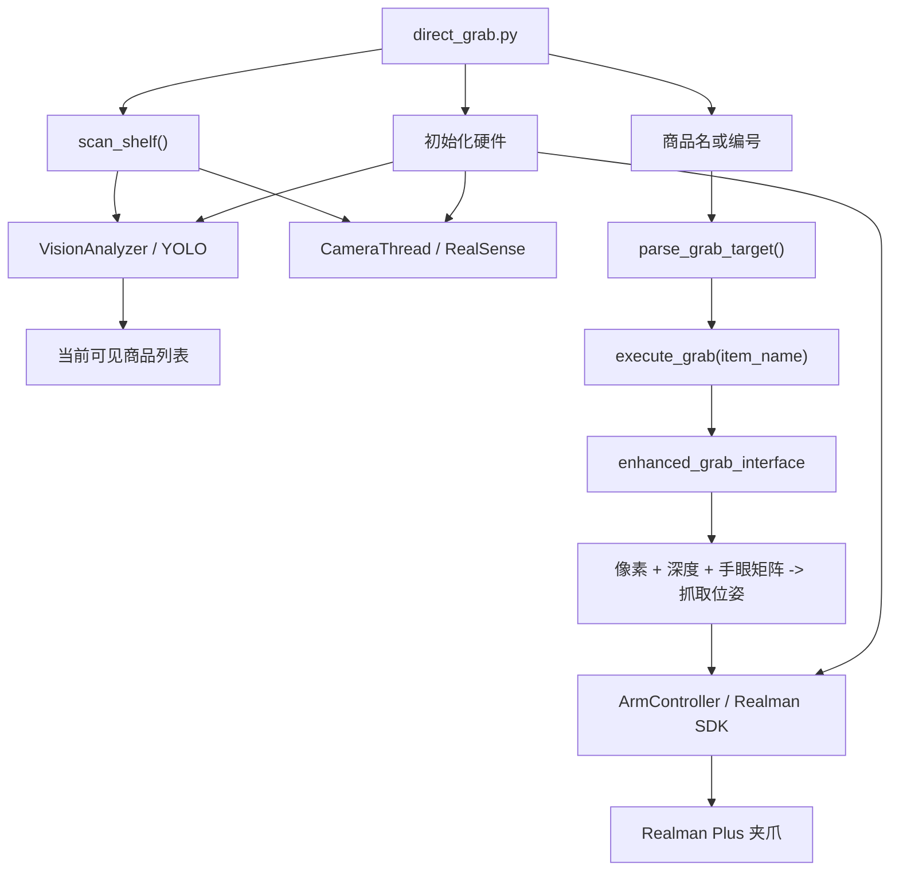
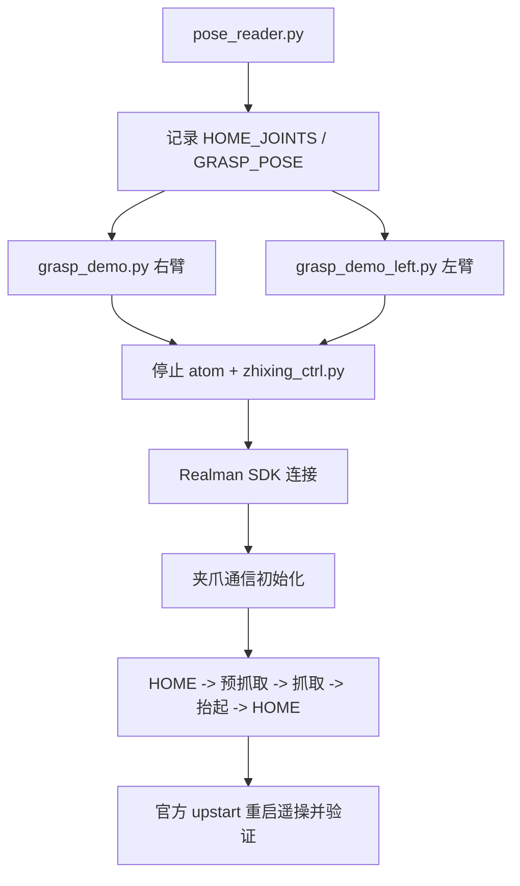
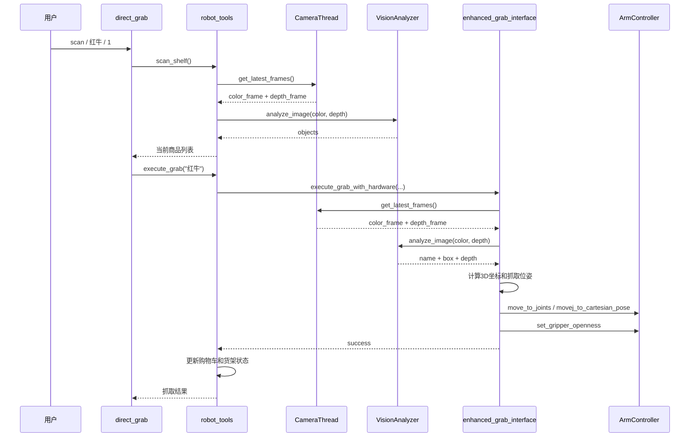

# 当前架构图

本文件只放图，详细运行方式见 [README.md](README.md) 和 [docs/demo_operation_guide.md](docs/demo_operation_guide.md)。

## 直接抓取主路径

```mermaid
flowchart TD
  Main["direct_grab.py"] --> Init["初始化硬件"]
  Init --> Vision["VisionAnalyzer / YOLO"]
  Init --> Camera["CameraThread / RealSense"]
  Init --> Arm["ArmController / Realman SDK"]

  Main --> Scan["scan_shelf()"]
  Scan --> Camera
  Scan --> Vision
  Vision --> Items["当前可见商品列表"]

  Main --> Command["商品名或编号"]
  Command --> Parse["parse_grab_target()"]
  Parse --> GrabTool["execute_grab(item_name)"]

  GrabTool --> Grab["enhanced_grab_interface"]
  Grab --> Pose["像素 + 深度 + 手眼矩阵 -> 抓取位姿"]
  Pose --> Arm
  Arm --> Gripper["Realman Plus 夹爪"]
```

## 单臂固定点 Demo

```mermaid
flowchart TD
  PoseReader["pose_reader.py"] --> Record["记录 HOME_JOINTS / GRASP_POSE"]
  Record --> RightDemo["grasp_demo.py 右臂"]
  Record --> LeftDemo["grasp_demo_left.py 左臂"]

  RightDemo --> Stop["停止 atom + zhixing_ctrl.py"]
  LeftDemo --> Stop
  Stop --> SDK["Realman SDK 连接"]
  SDK --> GripperInit["夹爪通信初始化"]
  GripperInit --> Motion["HOME -> 预抓取 -> 抓取 -> 抬起 -> HOME"]
  Motion --> Restore["官方 upstart 重启遥操并验证"]
```

## 直接抓取时序

```mermaid
sequenceDiagram
  participant User as 用户
  participant Main as direct_grab
  participant Tools as robot_tools
  participant Cam as CameraThread
  participant Vision as VisionAnalyzer
  participant Grab as enhanced_grab_interface
  participant Arm as ArmController

  User->>Main: scan / 红牛 / 1
  Main->>Tools: scan_shelf()
  Tools->>Cam: get_latest_frames()
  Cam-->>Tools: color_frame + depth_frame
  Tools->>Vision: analyze_image(color, depth)
  Vision-->>Tools: objects
  Tools-->>Main: 当前商品列表
  Main->>Tools: execute_grab("红牛")
  Tools->>Grab: execute_grab_with_hardware(...)
  Grab->>Cam: get_latest_frames()
  Cam-->>Grab: color_frame + depth_frame
  Grab->>Vision: analyze_image(color, depth)
  Vision-->>Grab: name + box + depth
  Grab->>Grab: 计算3D坐标和抓取位姿
  Grab->>Arm: move_to_joints / movej_to_cartesian_pose
  Grab->>Arm: set_gripper_openness
  Grab-->>Tools: success
  Tools->>Tools: 更新购物车和货架状态
  Tools-->>Main: 抓取结果
```
