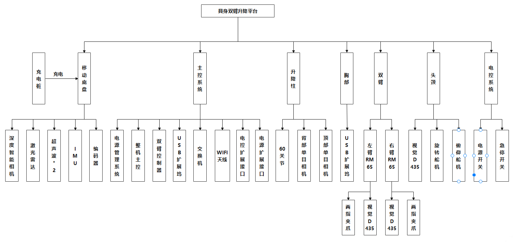
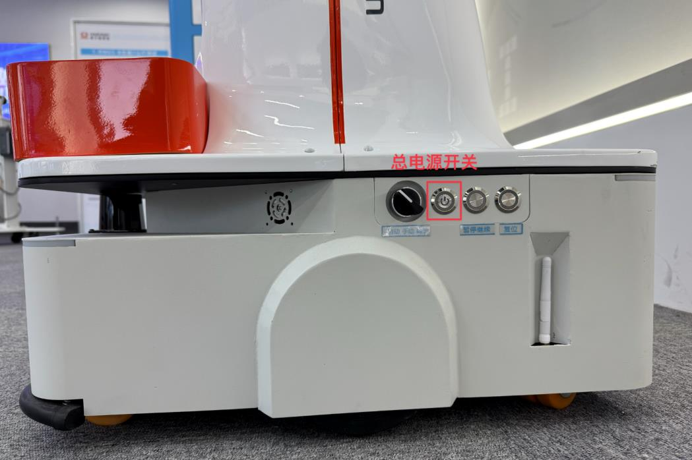
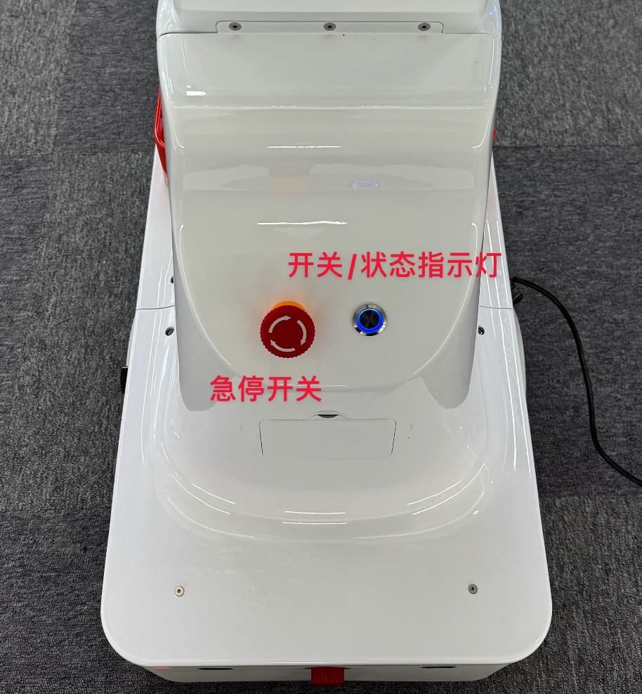
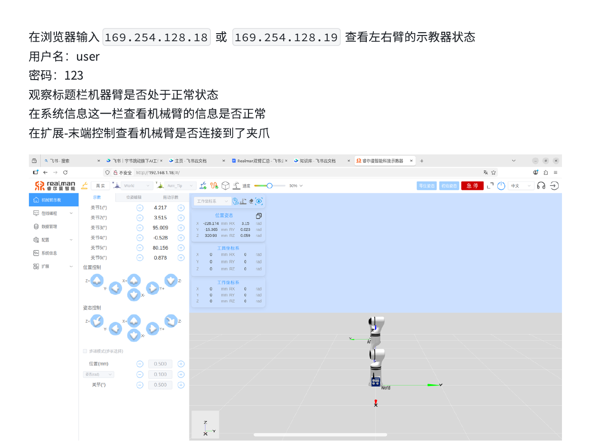

# Realman 双臂机器人 · 使用指南

本文档覆盖从开机、网络连接、控制方式到硬件验证的完整流程。  
进阶操作见 [docs/](docs/) 目录下的各专项文档。

---

## 目录

1. [硬件概览](#一硬件概览)
2. [网络与连接](#二网络与连接)
3. [开关机](#三开关机)
4. [后台进程与控制权](#四后台进程与控制权)
5. [控制方式](#五控制方式)
6. [相机](#六相机)
7. [硬件验证（首次上手）](#七硬件验证首次上手)
8. [常见问题](#八常见问题)
9. [参考文档](#九参考文档)

---

## 一、硬件概览

| 模块 | 说明 |
|------|------|
| 主控 | Jetson AGX Orin 64G + 1T SSD |
| 移动底盘 | 自主导航、避障、供电；总电源开关在底盘右侧 |
| 升降柱 | 遥操手柄右臂上下按键控制高度 |
| 双臂 | RM75-BI 七轴机械臂 × 2，末端 Realman Plus 两指平行夹爪 |
| 头部 | 俯仰关节 + 旋转关节 + 双目深度相机 |
| 腕部相机 | 左右腕各一个 RealSense 深度相机 |



完整硬件说明见 `realman资产/具身双臂升降平台使用手册-20250227.pdf`。

---

## 二、网络与连接

各模块通过 169.254.x.x 链路本地网段通信。

| 模块 | IP | 端口 | 账号 / 密码 |
|------|-----|------|------------|
| 主控（Ubuntu） | 169.254.128.20 | SSH 22 | rm / rm |
| 移动底盘 | 169.254.128.2 | — | woosh / wooshrobot |
| 左臂控制器 | 169.254.128.18 | 8080 | — |
| 右臂控制器 | 169.254.128.19 | 8080 | — |
| 左臂示教器（浏览器） | 169.254.128.18 | 80 | user / 123 |
| 右臂示教器（浏览器） | 169.254.128.19 | 80 | user / 123 |
| 底盘热点密码 | — | — | woosh888 |

SSH 到机器人主机：

```bash
ssh rm@192.168.3.68    # 局域网
password: rm
```

---

## 三、开关机

### 开机

1. 长按底盘右侧**总电源开关**，听到连续响声后松开。

   

2. 检查**急停开关**：如处于按下状态，顺时针旋转使其弹起，再按下背部开机按钮，指示灯变蓝即正常开机。

   

开机后主机自动启动 `atom`、`head_servo`、`effector` 三个进程，随即可以遥操，详见 [5.1 遥操](#51-遥操)。

### 关机

长按总电源开机按钮，听到连续声响后松手。

---

## 四、后台进程与控制权

**这是最容易踩坑的部分。** 理解它可以避免绝大多数奇怪现象。

### 两个关键后台进程

| 进程 | 频率 | 作用 |
|------|------|------|
| `atom` | ~100 Hz | 关节遥操控制器，持续向双臂发 CANFD 位置保持指令 |
| `zhixing_ctrl.py` | ~10 Hz | 夹爪遥操控制器，持续向夹爪发位置命令 |

### 为什么会产生冲突

这两个进程一旦在运行，任何外部程序（ROS driver、SDK、Python 脚本）发出的命令都会立刻被覆盖：

```
程序发 movej/movel        →  atom 立刻发位置保持，手臂不动
程序发 gripper open/close →  zhixing_ctrl.py 立刻覆盖，夹爪不动
```

最严重的情况：`zhixing_ctrl.py` 未停止时发了 `block: true` 的夹爪命令，
超时后会导致夹爪 RS485 控制器锁死，**需要断电重启才能恢复**。

### 查看进程状态

```bash
ps aux | grep -E 'atom|zhixing' | grep -v grep
```

### 各场景需要停哪些进程

| 使用场景 | 需要停 atom | 需要停 zhixing | 结束后恢复方式 |
|---------|:-----------:|:-------------:|--------------|
| 遥操（日常） | 否 | 否 | 无需操作 |
| SDK / ROS 控制关节 | **是** | 可选 | `upstart_all.sh` + 双按钮 |
| SDK / ROS 控制夹爪 | 可选 | **是** | 重新启动进程 |
| LeRobot 数据采集 | 否 | 否 | 无需操作 |

停止命令：

```bash
pkill -x atom
pkill -f zhixing_ctrl.py
```

---

## 五、控制方式

### 5.1 遥操

开机后自动就绪，是日常最常用的方式。

打开主机电脑时，会自动启动 `atom`、`head_servo`、`effector` 三个终端，用于遥操控制。此时遥操左右臂同时按下电源键，就可以遥操控制了。

如果手动关闭了 `atom`、`head_servo`、`effector` 终端页面，遥操就无法控制了。此时需要打开主机电脑主文件夹下的 `~/rmc_aida_l_atom`，打开终端运行：

```bash
bash upstart_all.sh
```

运行完成后同时按下遥操左右臂电源键，就可以继续遥操了。

机械臂末端按钮操作：

- **长按**末端**绿色**按钮：机械臂进入可拖动状态，拖动过程中自动进行实时轨迹记录，松开绿色按钮即完成轨迹记录
- **短按**末端**蓝色**按钮：机械臂自动回到轨迹起始位置，并进行一次轨迹复现（只复现最后一次记录的拖动轨迹）
- **长按**末端**蓝色**按钮：机械臂开始运动到初始位姿，松开停止

### 5.2 ROS2 控制

> 完整步骤见 [docs/realman_ros_camera_gripper_operation_guide.md](docs/realman_ros_camera_gripper_operation_guide.md)

每个终端先 source：

```bash
source /opt/ros/humble/setup.bash
source ~/ros2_ws/install/setup.bash
```

**启动右臂 driver（建议单独调右臂时用）：**

```bash
/home/rm/ros2_ws/install/dual_rm_driver/lib/dual_rm_driver/dual_rm_driver \
  --ros-args \
  -r __ns:=/right_arm_controller \
  --params-file /home/rm/ros2_ws/install/dual_rm_driver/share/dual_rm_driver/config/dual_75_right_config.yaml
```

**夹爪控制（先停 `zhixing_ctrl.py`，始终用 `block: false`）：**

```bash
# 打开
ros2 topic pub --once /right_arm_controller/rm_driver/set_gripper_position_cmd \
  rm_ros_interfaces/msg/Gripperset "{position: 1000, block: false, timeout: 5}"

# 闭合
ros2 topic pub --once /right_arm_controller/rm_driver/set_gripper_position_cmd \
  rm_ros_interfaces/msg/Gripperset "{position: 1, block: false, timeout: 5}"
```

监听结果：

```bash
ros2 topic echo /right_arm_controller/rm_driver/set_gripper_position_result
```

### 5.3 TCP 直接控制（不依赖 ROS）

通过 SIGSTOP/SIGCONT 暂停 atom，控制完再恢复。TCP JSON 单位是毫度（1000 = 1°）。

```python
# 关节运动
req({"command": "movej", "joint": [j1, j2, j3, j4, j5, j6, j7], "v": 20, "r": 0})

# 夹爪（先停 zhixing_ctrl.py，初始化 RS485 后发）
req({"command": "set_rm_plus_mode", "mode": 115200})
req({"command": "hand_follow_pos", "hand_pos": [1000]})  # 打开
req({"command": "hand_follow_pos", "hand_pos": [0]})     # 闭合
```

关节方向参考：

| 关节 | 说明 |
|------|------|
| j1 | 肩部旋转 |
| j2 | 肩部抬降（幅度最明显） |
| j3 | 大臂扭转 |
| j4 | 肘关节弯曲（幅度明显） |
| j5 | 小臂扭转 |
| j6 | 腕部俯仰 |
| j7 | 末端旋转 |

---

## 六、相机

平台共有三路 RealSense 相机，数据采集时同时录制：

| 标识 | 位置 | 用途 |
|------|------|------|
| `base_0` | 头部，俯视工作台 | 全局视角，观察场景和目标物 |
| `left_wrist_0` | 左臂腕部 | 左臂末端局部视角 |
| `right_wrist_0` | 右臂腕部 | 右臂末端局部视角 |

各相机对应的图像 key 和 RealSense 序列号：

| 位置 | 图像 key | RealSense serial |
|------|------|------|
| 头部/底座相机 | `base_0_rgb` / `head` | `153122071777` |
| 左腕相机 | `left_wrist_0_rgb` / `left_hand` | `335522072194` |
| 右腕相机 | `right_wrist_0_rgb` / `right_hand` | `405622073249` |

### 拍快照

```bash
cd ~/Dev/bi_realman_ws/third_party/lerobot_robot_bi_realman
conda activate lerobot

# 检查相机是否被识别
python3 - <<'PY'
import pyrealsense2 as rs
ctx = rs.context()
devices = ctx.query_devices()
print("RealSense device count:", len(devices))
for i, dev in enumerate(devices):
    print(i, dev.get_info(rs.camera_info.name), dev.get_info(rs.camera_info.serial_number))
PY

# 拍快照（三路相机同时保存）
python3 scripts/capture_realsense_snapshot.py \
  --output_dir=outputs/captured_images \
  --warmup_frames=5
```

从 Mac 拉取图片：

```bash
mkdir -p ~/Downloads/realman_captured_images
scp -r rm@192.168.3.68:/home/rm/Dev/bi_realman_ws/third_party/lerobot_robot_bi_realman/outputs/captured_images/* \
  ~/Downloads/realman_captured_images/
open ~/Downloads/realman_captured_images
```

---

## 七、硬件验证（首次上手）

第一次使用这套平台，建议按以下顺序逐步确认各模块可用。

### 7.1 示教器状态检查

在浏览器打开 `http://169.254.128.18`（左臂）或 `http://169.254.128.19`（右臂），账号 `user` / 密码 `123`：

- 标题栏确认机械臂处于正常状态
- 「系统信息」查看机械臂信息是否正常
- 「扩展 - 末端控制」确认已连接夹爪



### 7.2 关节状态读取

```bash
# 终端 1：先监听结果
ros2 topic echo /right_arm_controller/rm_driver/get_current_arm_original_state_result --once

# 终端 2：再发查询
ros2 topic pub --once /right_arm_controller/rm_driver/get_current_arm_state_cmd std_msgs/msg/Empty "{}"
```

> 当前不要用 `/joint_states` 判断关节角，它可能全是 0。

### 7.3 升降测试

```bash
python3 test/test_lift.py
```

脚本连接 `169.254.128.18`，读取当前高度，交互确认后依次：下降 100mm → 上升 50mm → 恢复原始高度。每步需按 Enter 确认，可随时 Ctrl+C 取消。

### 7.4 头部舵机测试

当前稳定脚本通过 UDP 与后台 `head_servo_ctrl.py` 通信，不直接开串口，日常检查用这个：

```bash
cd /home/rm/test
python3 test_head_udp.py read
```

**软件限位**

| 角度 | 舵机 | 动作 | 范围 | 中位 |
|---|---|---|---:|---:|
| `angle1` | ID=1 | 俯仰，上/下 | `400 ~ 600` | `500` |
| `angle2` | ID=2 | 偏航，左/右 | `200 ~ 800` | `500` |

`angle1` / `angle2` 是舵机总线读回的原始位置值，不是角度制的度数。程序会把目标值 clamp 到这些范围内，避免撞机械限位。

回中就是让两个值接近：

```text
angle1 ~= 500
angle2 ~= 500
```

如果换舵机后方向感觉反了，先用小步测试（`--repeat 2`），不要一上来打大范围。

> 如果 `read` 一直收不到角度广播，说明后台 `head_servo_ctrl.py` 没在运行，UDP 版的所有动作都不会生效，此时改用下面的直连串口版。

**直连串口版（备用）**

```bash
sh test/run_head_servo.sh    # 使用机器人本机 Python（含 pyserial）
```

交互命令：`c` 回中，`l` / `r` 左右，`u` / `d` 上下，`read` 读当前角度，`q` 退出。

> 已知问题：ID=1 舵机目前只能左右旋转，不能上下俯仰。

---

## 八、常见问题

### 发了命令但手臂不动

`atom` 仍在运行，正以高频位置保持命令覆盖外部指令。确认当前是遥操还是程序控制模式，不要同时从两边发命令。

### 夹爪只动一点或没反应

先确认 `zhixing_ctrl.py` 已停止，再发最大幅度命令（`position: 1` → `position: 1000`）测试。同时监听 result topic 查看返回值。

### 夹爪锁死，断电才能恢复

`zhixing_ctrl.py` 未停止时使用了 `block: true`，RS485 控制器超时锁死。需要**断电重启**机器人恢复。之后始终使用 `block: false`。

### `ros2 topic pub` 只显示 publishing，没有结果

正常现象，命令只是发出去了。需要在另一个终端监听 result topic：

```bash
ros2 topic echo /right_arm_controller/rm_driver/set_gripper_position_result
```

### `/joint_states` 全是 0

不要依赖此 topic。改用专用查询接口：

```bash
# 终端 1 先监听
ros2 topic echo /right_arm_controller/rm_driver/get_current_arm_original_state_result --once
# 终端 2 再发查询
ros2 topic pub --once /right_arm_controller/rm_driver/get_current_arm_state_cmd std_msgs/msg/Empty "{}"
```

### conda 里找不到 lerobot 或 pyrealsense2

```bash
conda activate lerobot
which python3    # 应为 /home/rm/miniconda3/envs/lerobot/bin/python3
```

### 头部舵机串口打不开

确认在机器人**本机**运行（非 SSH），检查 `/dev/rmUSB3` 是否存在；不存在则修改 `test/test_head_servo.py` 里的 `PORT` 变量。

---

## 九、参考文档

| 文档 | 内容 |
|------|------|
| [docs/realman_ros_camera_gripper_operation_guide.md](docs/realman_ros_camera_gripper_operation_guide.md) | ROS2 driver 启动、TCP 直接控制、夹爪完整操作流程 |
| `realman资产/具身双臂升降平台使用手册-20250227.pdf` | 官方硬件手册 |
| `realman资产/具身双臂机器人接口文档.pdf` | SDK 接口文档 |
| `realman资产/具身双臂机器人ROS2-README_CN.pdf` | ROS2 接口说明 |
| `realman资产/dual_arm_collection_sdk-main/` | 数采 SDK 示例代码 |
